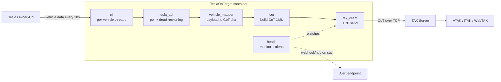
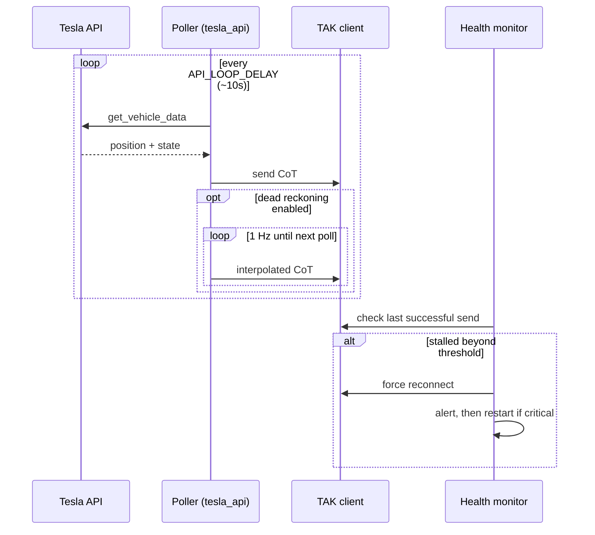
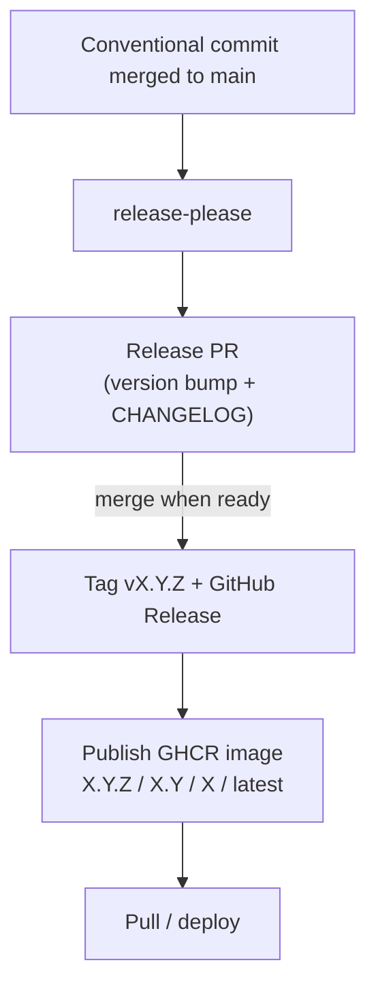

# Architecture

TeslaOnTarget is a small, single-purpose bridge: it polls the Tesla Owner API, turns each response into a Cursor-on-Target (CoT) event, and streams it to a TAK server — with smoothing between polls and self-healing on failure.

## System overview

## Modules

| Module | Responsibility |
|--------|----------------|
| `cli` | Startup, config load + validation, one daemon tracking thread per vehicle, shared TAK client + health monitor |
| `config_handler` | Immutable `AppConfig` (frozen dataclass) + `load_config()` — config is loaded once and injected, never mutated globally |
| `tesla_api` (`TeslaCoT`) | Polls the vehicle, orchestrates the per-cycle flow, runs dead-reckoning interpolation, classifies/handles API errors |
| `vehicle_mapper` | Pure functions mapping a raw Tesla payload → the flat CoT data dict (no I/O, independently testable) |
| `cot` | Builds the CoT XML event and frames it for TAK |
| `tak_client` | TCP connection to the TAK server; fail-fast send with background reconnect |
| `health` | Background monitor: detects stalled sends, forces reconnect, alerts, and exits for a supervisor restart when critical |
| `constants` | Shared physical constants (unit conversions, Earth radius) |
| `auth` | Interactive Tesla OAuth token setup |

## Runtime flow

**Dead reckoning** smooths the display between the 10-second API polls: while the vehicle moves, the poller projects position forward from the last known point using speed + heading and emits ~1 Hz CoT updates, so the marker glides instead of jumping.

**Resilience** is layered: `tak_client.send_cot` never loops or waits on a dead server — at most one bounded connection attempt (10s socket timeout), and on failure it marks itself disconnected, kicks an idempotent background reconnect, and returns. The `health` monitor independently watches the time since the last successful send and escalates: force-reconnect → alert → restart-for-recovery. See [CONFIGURATION.md](CONFIGURATION.md) for the thresholds and `ALERT_WEBHOOK_URL`.

## Release & delivery

Versioning and the CHANGELOG are generated from Conventional Commits by release-please; merging the release PR tags the release and publishes the multi-arch GHCR image. CI also enforces 100% line+branch test coverage, a mutation gate, and Trivy security scanning on every PR.
